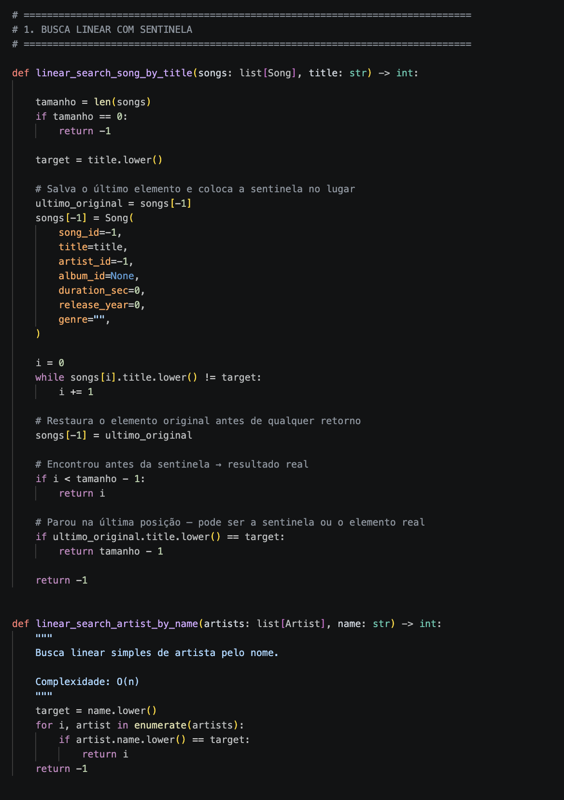
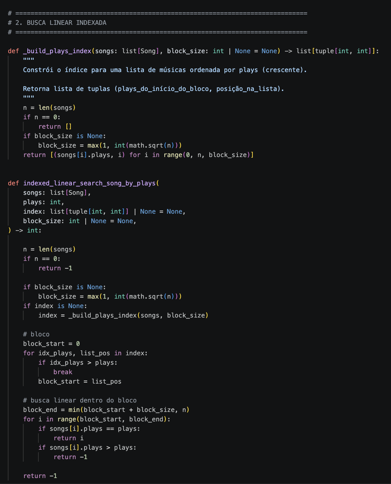
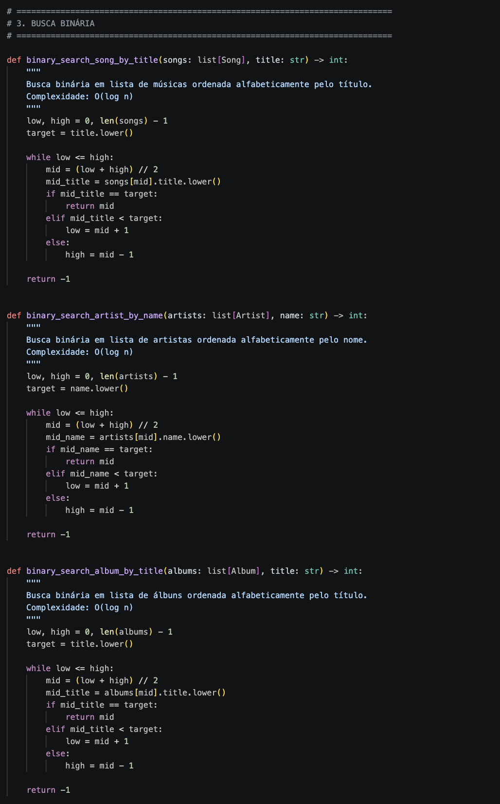
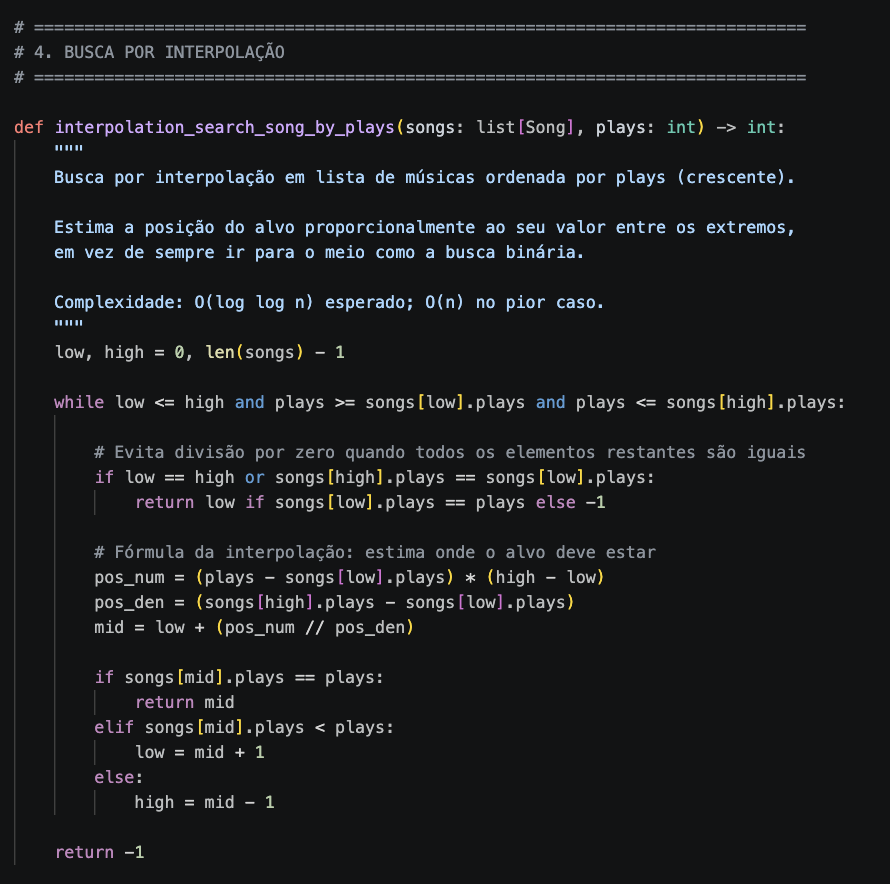
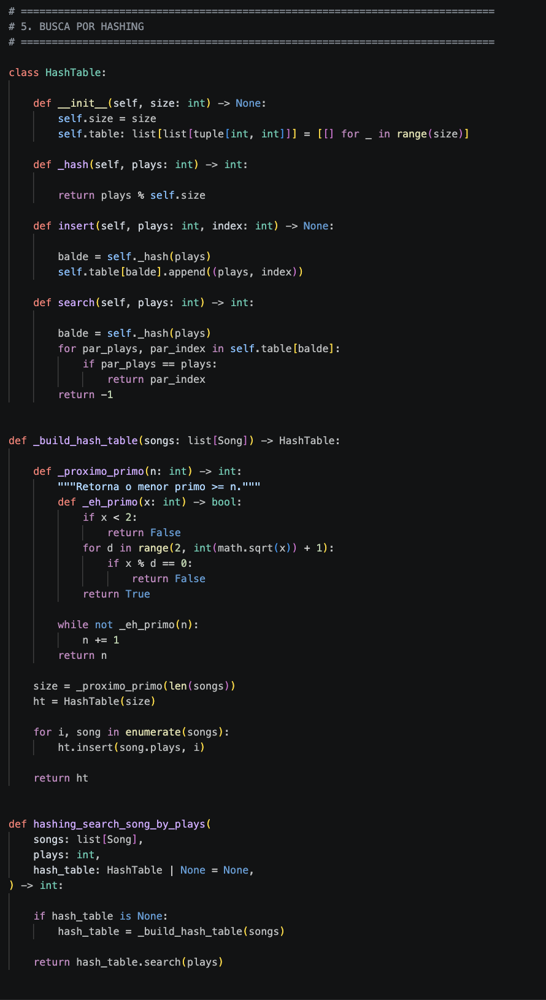

# MusicDB — Plataforma de Dados Musicais

**Número da Lista:** Trabalho 1 - Busca <br>
**Conteúdo da Disciplina:** Algoritmos de Busca <br>

## Alunos
| Matrícula | Aluno |
| -- | -- |
| 231026385 | Igor Veras Daniel |
| 231026483 | Maria Eduarda de Amorim Galdino |
---

## Sobre 

O MusicDB é um sistema orientado a objetos que simula o catálogo interno de uma plataforma de streaming musical. Ele armazena informações sobre **artistas**, **bandas**, **álbuns** e **músicas** — incluindo colaborações (**feats**) — e serve como base real para você implementar e comparar diferentes algoritmos de busca estudados na disciplina.

A ideia é simples: ao invés de rodar algoritmos sobre arrays genéricos de inteiros, você vai buscá-los sobre **dados com significado real**, o que torna a análise de desempenho muito mais interessante.

---

## Screenshots

#### Busca linear com sentinela


#### Busca linear indexada


#### Busca binária


#### Busca por interpolação


#### Busca por hashing


--- 

## Uso

### Pré-requisitos
- Python 3.10 ou superior (usa `list[str]` como type hint nativo)
- Nenhuma dependência externa necessária

### Rodando o projeto

```bash
# A partir da pasta G8-BUSCA-2026.1/
PYTHONPATH=. python main.py
```

Você verá no terminal:
- Estatísticas gerais do catálogo
- Todas as listas ordenadas com índices visíveis
- Os feats de um artista de exemplo
- As faixas de um álbum
- O resultado do benchmark

### Validando os dados

```bash
PYTHONPATH=. python data/seed.py
```

---

## Análise de Desempenho (Benchmark)

Após implementar os algoritmos, chame `benchmark(catalog)` em `main.py` para comparar o tempo de execução médio de cada um:

```
============================================================
BENCHMARK DOS ALGORITMOS DE BUSCA — MusicDB
============================================================
  Busca Linear (título)              resultado= 8  avg=2.41 µs
  Busca Binária (título)             resultado= 8  avg=0.89 µs
  Busca Linear (artista)             resultado=15  avg=1.73 µs
  Busca Binária (artista)            resultado=15  avg=0.61 µs
============================================================
```

## Link do Vídeo 

[](https://youtu.be/v8khOyGnKVM)
